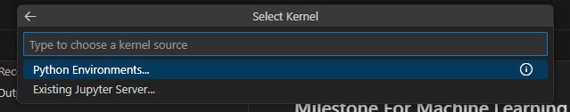
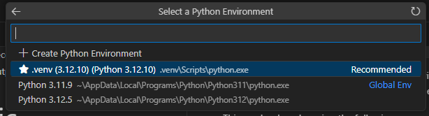
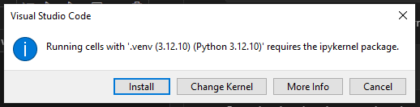

## Milestone For Machine Learning Music Recommender

This notebook works best if it used locally. It should also be noted that the notebook was developed using visual studio in conjunction with the jupyter plug in developed by microsoft. The following directions assume that you have both already installed.

---
### Directions For Running Notebook
First we need to create a python virtual envoirnment by using the command below in the root directory of the notebook.

    python -m venv .venv

We will then activate the virtual enviornment with this command...

    ./.venv/Scripts/activate

Once the virtual enviornment is activated, we will need to install the dependencies for this project using the included "requirements.txt" file.

This can be done by using the following command...

    pip install -r requirements.txt

Now, in visual studio, if we try to run any code block in the notebook, it will ask us to select a kernal to which you will choose the virtual enviornment that you just created.

As a final note, you will get a pop-up notification upon running any code block that will look like the image below... 

When this happens, just click install and wait for it to complete.

### You should now be able to run the code in the notebook :)
 

